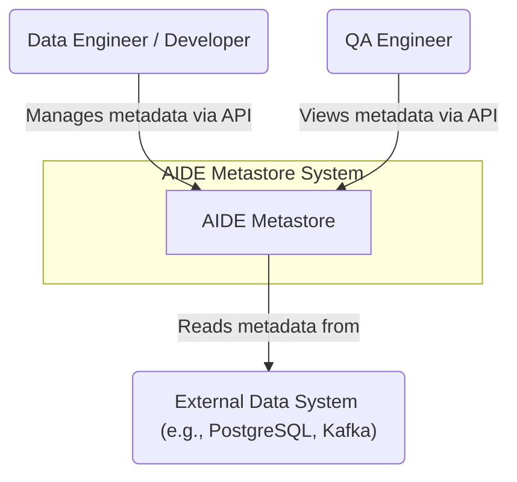

# C1: System Context Diagram

This diagram shows the system in its environment, including the key users (actors) and external systems it interacts with.

| Element | Description |
|---|---|
| **Data Engineer / Developer** | The primary user of the system. Manages (creates, updates, deletes) metadata for systems, datasets, and other entities via the API. |
| **QA Engineer** | A user who primarily reads metadata to understand data sources and structures for testing purposes. |
| **AIDE Metastore** | The system being described. It provides a centralized API for managing data platform metadata. |
| **External Data System** | Represents any external data source or target (e.g., a database, a message queue, a data lake) for which the AIDE Metastore stores metadata. The interaction is conceptual; the Metastore holds information *about* these systems. |

