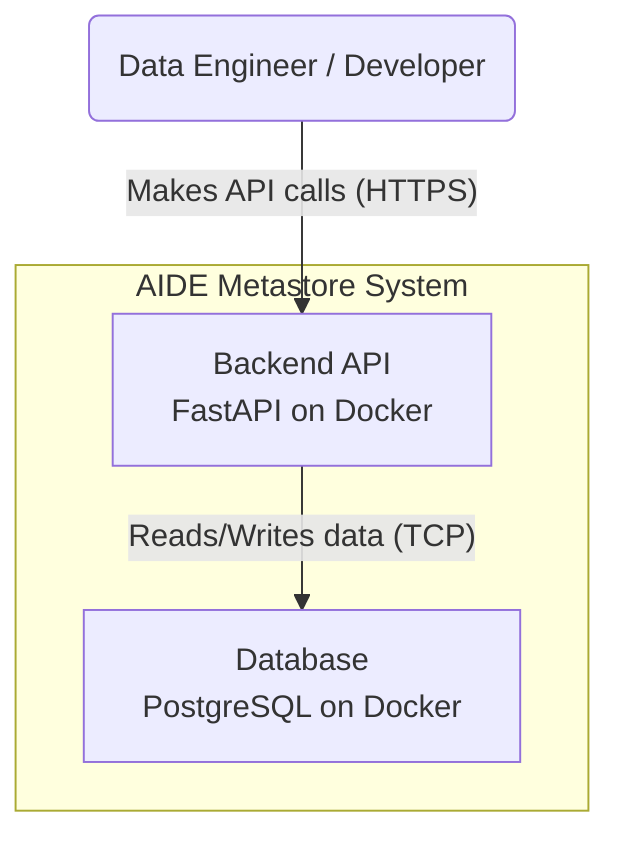

# C2: Container Diagram

This diagram zooms into the AIDE Metastore system, showing its high-level technical building blocks (containers). In this context, a "container" is a deployable and runnable unit, such as a backend application or a database.

| Container | Description | Technology |
|---|---|---|
| **Backend API** | The core of the system. It's a Python application that exposes a RESTful API for all metadata operations. It handles business logic, authentication, and validation. | FastAPI (Python) in a Docker container |
| **Database** | The persistence layer for all metadata. It stores information about systems, datasets, schemas, users, etc. | PostgreSQL in a Docker container |

