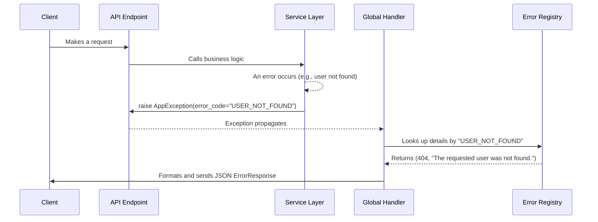

# Common Patterns and Guides

This document describes common patterns and implementation details that developers should be aware of when working on the application.

## 1. API Endpoint Structure

The API is built using the FastAPI framework. All incoming HTTP requests are handled by the presentation layer, which is responsible for routing, request validation, and serialization.

### Key Components

- **`backend/main.py`**: The main application entrypoint. It initializes the FastAPI app, includes global middleware (CORS, logging), and registers the API routers.

- **`backend/api/v1/`**: This directory contains modular `APIRouter` instances. Each file typically corresponds to a specific domain entity (e.g., `users.py`, `datasets.py`).

- **`backend/schemas/`**: Pydantic models are used to define the schemas for request bodies, query parameters, and response bodies. This provides automatic validation and OpenAPI documentation.

### Request Lifecycle

1.  An HTTP request arrives and is matched to an endpoint defined in a router.

2.  FastAPI validates the incoming data (path, query, body) against the Pydantic schemas defined in the endpoint's signature.

3.  Dependencies, such as the corresponding service class and the `UnitOfWork`, are injected into the endpoint function using `Depends()`.

4.  The endpoint function calls the relevant method in the injected service, passing the validated data.

5.  The service layer executes the business logic and returns a result (usually a domain model or a DTO).

6.  FastAPI automatically serializes the result into a JSON response, using the `response_model` defined for the endpoint.

## 2. Centralized Error Handling

To ensure consistent and predictable error responses across the API, we use a centralized error handling system. This avoids scattering `try...except` blocks and `HTTPException`s throughout the application code.

### Key Components

- **`backend/core/errors.py`**: An "Error Registry" that maps unique, human-readable error codes (e.g., `USER_NOT_FOUND`) to their corresponding HTTP status code and a default detail message. This is the single source of truth for all defined business errors.

- **`backend/core/exceptions.py`**: Defines a base `AppException` class. All custom business logic exceptions must inherit from this class. An `AppException` is initialized with an `error_code` from the registry.

- **`backend/main.py`**: A global exception handler (`@app.exception_handler(AppException)`) is registered. This handler catches any `AppException` that bubbles up to the presentation layer.

- **`backend/schemas/error.py`**: A Pydantic `ErrorResponse` schema defines the standard JSON structure for all error responses: `{ "error_code": "...", "detail": "..." }`.

### Error Handling Flow

1.  A business logic error occurs within a **Service Layer** method (e.g., a requested user does not exist).

2.  The service raises a specific exception inheriting from `AppException`, providing the relevant error code: `raise AppException(error_code=errors.USER_NOT_FOUND)`.

3.  The exception propagates up from the service to the API endpoint and is caught by the **Global Exception Handler**.

4.  The handler extracts the `error_code` from the exception.

5.  It looks up the corresponding HTTP status and message in the `ERROR_MAP`.

6.  It constructs and returns a `JSONResponse` with the correct status code and a body matching the `ErrorResponse` schema.

This approach ensures that all API errors are consistent, easy to document, and simple for clients to parse.

