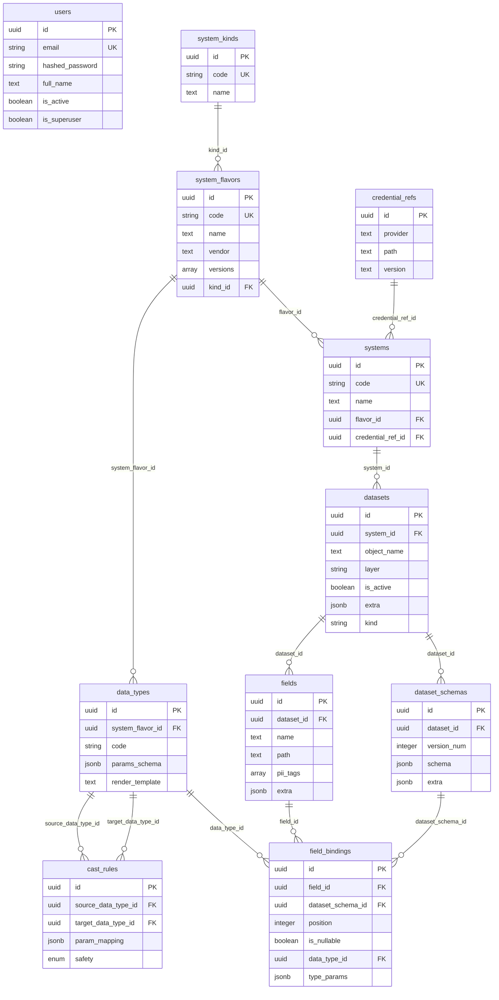
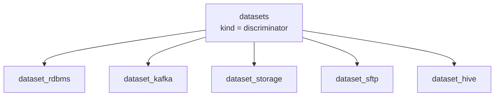

# AIDE Metastore v2 Data Model Analysis

**Date:** 2026-04-06
**Sources:** `backend/models/`, `architecture/data-model-documentation.md`, `docs/AIDE_data_model.json`

---

## 1. Overview

The AIDE Metastore v2 data model is a normalized relational schema consisting of **16 tables** (including 5 polymorphic subtables for datasets). It is organized around three key subsystems:

1. **Type system** — classification and definition of data types
2. **Data system** — description of platforms and datasets
3. **Schema versioning** — evolution of dataset structures

---

## 2. ER Diagram



---

## 3. Type Subsystem

### Chain: SystemKind -> SystemFlavor -> DataType -> CastRule

```
SystemKind (RDBMS, MESSAGE_QUEUE, STORAGE, ...)
    |
    v
SystemFlavor (PostgreSQL, MySQL, Kafka, S3, Hive, ...)
    |
    v
DataType (VARCHAR, BIGINT, DECIMAL, AVRO, ...)
    |                    |
    v                    v
CastRule (source -> target with safety and param_mapping)
```

**Purpose:** Describes the entire hierarchy of technologies and native data types.

### Parametric Type System

A key feature of the model is **parametric data types**. Each `DataType` is described by three components:

| Component | Table.Column | Purpose |
|-----------|-------------|---------|
| `params_schema` | `data_types.params_schema` | JSON Schema defining the type parameters |
| `render_template` | `data_types.render_template` | Jinja2 template for generating the final type string |
| `type_params` | `field_bindings.type_params` | Specific parameter values for the instance |
| `param_mapping` | `cast_rules.param_mapping` | Parameter mapping formulas for casting |

**Example for PostgreSQL DECIMAL:**

```
params_schema:    {"properties": {"precision": {"type": "integer"}, "scale": {"type": "integer"}}}
render_template:  DECIMAL({{ precision }}, {{ scale }})
type_params:      {"precision": 10, "scale": 2}
Result:           DECIMAL(10, 2)
```

**Example mapping Oracle NUMBER -> PostgreSQL DECIMAL:**

```json
{
  "precision": "source.p",
  "scale": "source.s"
}
```

### CastRule — Safety Classification

| Level | Meaning | Example |
|-------|---------|---------|
| `IMPLICIT` | Automatic lossless cast | INTEGER -> BIGINT |
| `SAFE` | Lossless but requires explicit conversion | VARCHAR -> INTEGER |
| `UNSAFE` | Potential data loss | BIGINT -> INTEGER |

---

## 4. Data Subsystem

### Chain: System -> Dataset -> Field

```
System (specific instance: "prod-postgres-01", "kafka-cluster-eu")
    |
    v
Dataset (table, topic, file, ...)
    |
    v
Field (logical field: "customer_email", "order_total")
```

### Polymorphic Datasets

Dataset uses **joined table inheritance** (table-per-class) via the `kind` discriminator:



| Subtype | Specific Fields |
|---------|----------------|
| `dataset_rdbms` | catalog_name, schema_name, table_name, is_view, pk_columns, uq_constraints |
| `dataset_kafka` | topic, format, partitions, retention_ms, key_columns |
| `dataset_storage` | path, file_format, compression, partition_by |
| `dataset_sftp` | path, file_format, compression, archive |
| `dataset_hive` | catalog_uri, db_name, table_name, file_format, serde, partition_cols |

---

## 5. Schema Versioning Subsystem

### Chain: Dataset -> DatasetSchema -> FieldBinding -> (Field + DataType)

```
Dataset
    |
    +--> DatasetSchema (version_num=1, version_num=2, ...)
    |       |
    |       +--> FieldBinding (field + data_type + position + type_params)
    |       +--> FieldBinding
    |       +--> ...
    |
    +--> Field (logical definition: name, path, pii_tags)
```

**Key idea:** Logical `Field` entities are defined once. `FieldBinding` links a specific field to a specific schema version, defining position, data type, and nullability. This allows:

- Tracking schema evolution
- Having one Field in different versions with different types
- Fixing column position for each version

### FieldBinding Unique Constraints

- `(field_id, dataset_schema_id)` — a field can appear only once in a schema version
- `(position, dataset_schema_id)` — position is unique within a version

---

## 6. Common Patterns (MetaDataMixin)

All domain tables inherit from `MetaDataMixin`:

| Column | Type | Purpose |
|--------|------|---------|
| `id` | UUID | Primary key (auto-generated) |
| `created_at` | DateTime | Creation time (server default) |
| `updated_at` | DateTime | Update time (server default) |
| `created_by` | UUID | Creator ID (nullable) |
| `updated_by` | UUID | Last editor ID (nullable) |
| `note` | Text | Arbitrary note |

---

## 7. Strengths Analysis

### 7.1. Normalization
The model is well normalized (3NF). Each entity has a clear responsibility. No data duplication.

### 7.2. Flexibility via JSONB
- `params_schema` — type parameter validation
- `type_params` — specific parameter values
- `param_mapping` — conversion formulas
- `extra` — extensibility without migrations
- `uq_constraints` — arbitrary constraints

### 7.3. Parametric Type System
A powerful mechanism for describing any data types with parameters and rendering templates. Allows codifying conversion rules between systems.

### 7.4. Schema Versioning
Separating logical fields (`fields`) from their binding to schema versions (`field_bindings`) is the correct approach for tracking evolution.

### 7.5. PII Tags
The `pii_tags` field on `fields` is a good foundation for governance and compliance.

### 7.6. Dataset Polymorphism
5 subtypes cover the main data source types in an enterprise environment.

---

## 8. Weaknesses and Risks Analysis

### 8.1. No Cascade Deletion

Relationships between tables lack `ON DELETE CASCADE`. Deleting a `System` won't delete related `Dataset` records. This can lead to:
- Errors on deletion (FK violation)
- Orphaned records when manually deleting from the database

**Recommendation:** Define a cascade deletion strategy or implement soft delete.

### 8.2. `created_by`/`updated_by` Without FK

The `created_by` and `updated_by` columns are plain UUIDs without a foreign key to `users`. This means:
- No referential integrity for auditing
- Possible dangling references to non-existent users
- Cannot JOIN to get the creator's name

**Recommendation:** Add FK or decide on soft delete for users.

### 8.3. No Indexes on JSONB Columns

Columns `params_schema`, `type_params`, `param_mapping`, `extra` have no GIN indexes. As data grows, JSONB queries will degrade.

**Recommendation:** Add GIN indexes on frequently queried JSONB fields.

### 8.4. No Soft Delete

Record deletion is irreversible. No `deleted_at` / `is_deleted` field. This is a risk for:
- Auditing and compliance
- Recovering accidentally deleted data
- Data lineage (loss of historical relationships)

### 8.5. No `type_params` Validation at the DB Level

`type_params` in `field_bindings` should conform to `params_schema` in `data_types`, but this validation is implemented neither at the DB level (CHECK constraint) nor in the service layer.

**Recommendation:** Add validation in `FieldBindingService._pre_create()`.

### 8.6. No Unique Constraint for CastRule

The `cast_rules` model has no unique constraint on `(source_data_type_id, target_data_type_id)` at the DB level (check exists only in the service).

### 8.7. No Dataset <-> DataType Relationship

There is no direct check that the `data_type_id` in `field_binding` belongs to the same `system_flavor` as the dataset's system. Theoretically, a PostgreSQL field could be bound to a Kafka type.

---

## 9. Documentation vs Code Comparison

| Aspect | Documentation | Code | Match |
|--------|--------------|------|-------|
| Tables | 16 tables described | 16 tables in models | Full |
| MetaDataMixin | Described | Implemented in `models/mixins.py` | Full |
| Polymorphism | 5 subtypes described | 5 subtypes implemented | Full |
| params_schema | Described with examples | Implemented as JSONB | Full |
| render_template | Described with examples | Implemented as Text | Full |
| cast_rules safety | 3 levels described | Enum with 3 values | Full |
| dataset_hive | Not described in detail in docs | Fully implemented | Code ahead of documentation |
| Unique constraints | Partially described | Implemented in migration 8 | Code ahead of documentation |

**Conclusion:** The data model documentation (`architecture/data-model-documentation.md`) generally **matches the code** but lags behind on recent changes (Hive, business keys).

---

## 10. Summary

The AIDE Metastore v2 data model is a **well-designed and normalized** schema for metadata management. Key strengths: parametric type system, polymorphic datasets, schema versioning. Main areas for improvement: cascade deletion, FK for auditing, JSONB validation, indexes.
