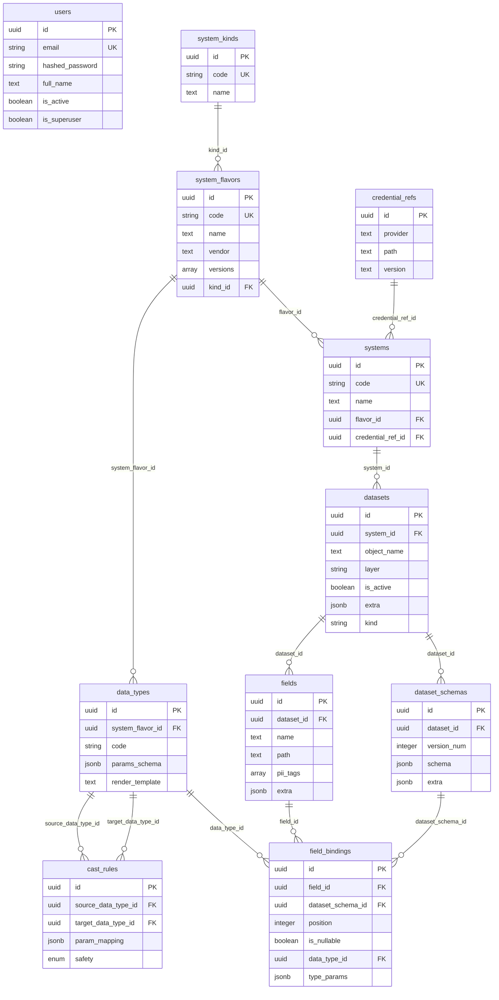
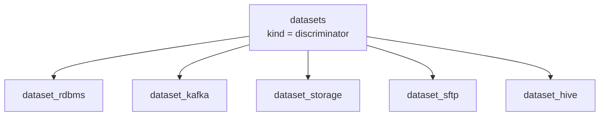

# Анализ модели данных AIDE Metastore v2

**Дата:** 2026-04-06
**Источники:** `backend/models/`, `architecture/data-model-documentation.md`, `docs/AIDE_data_model.json`

---

## 1. Обзор

Модель данных AIDE Metastore v2 — нормализованная реляционная схема из **16 таблиц** (включая 5 полиморфных подтаблиц для датасетов). Организована вокруг трех ключевых подсистем:

1. **Система типов** — классификация и определение типов данных
2. **Система данных** — описание платформ и датасетов
3. **Версионирование схем** — эволюция структуры датасетов

---

## 2. ER-диаграмма



---

## 3. Подсистема типов

### Цепочка: SystemKind → SystemFlavor → DataType → CastRule

```
SystemKind (RDBMS, MESSAGE_QUEUE, STORAGE, ...)
    |
    v
SystemFlavor (PostgreSQL, MySQL, Kafka, S3, Hive, ...)
    |
    v
DataType (VARCHAR, BIGINT, DECIMAL, AVRO, ...)
    |                    |
    v                    v
CastRule (source → target с safety и param_mapping)
```

**Назначение:** Описание всей иерархии технологий и нативных типов данных.

### Параметрическая система типов

Ключевая особенность модели — **параметрические типы данных**. Каждый `DataType` описывается тремя компонентами:

| Компонент | Таблица.Колонка | Назначение |
|-----------|----------------|------------|
| `params_schema` | `data_types.params_schema` | JSON Schema, определяющая параметры типа |
| `render_template` | `data_types.render_template` | Jinja2-шаблон для генерации финальной строки типа |
| `type_params` | `field_bindings.type_params` | Конкретные значения параметров для инстанса |
| `param_mapping` | `cast_rules.param_mapping` | Формулы маппинга параметров при кастинге |

**Пример для PostgreSQL DECIMAL:**

```
params_schema:    {"properties": {"precision": {"type": "integer"}, "scale": {"type": "integer"}}}
render_template:  DECIMAL({{ precision }}, {{ scale }})
type_params:      {"precision": 10, "scale": 2}
Результат:        DECIMAL(10, 2)
```

**Пример маппинга Oracle NUMBER → PostgreSQL DECIMAL:**

```json
{
  "precision": "source.p",
  "scale": "source.s"
}
```

### CastRule — классификация безопасности

| Уровень | Значение | Пример |
|---------|----------|--------|
| `IMPLICIT` | Автоматический каст без потерь | INTEGER → BIGINT |
| `SAFE` | Без потерь, но требует явного преобразования | VARCHAR → INTEGER |
| `UNSAFE` | Возможна потеря данных | BIGINT → INTEGER |

---

## 4. Подсистема данных

### Цепочка: System → Dataset → Field

```
System (конкретный инстанс: "prod-postgres-01", "kafka-cluster-eu")
    |
    v
Dataset (таблица, топик, файл, ...)
    |
    v
Field (логическое поле: "customer_email", "order_total")
```

### Полиморфные датасеты

Dataset использует **joined table inheritance** (table-per-class) через дискриминатор `kind`:



| Подтип | Специфичные поля |
|--------|-----------------|
| `dataset_rdbms` | catalog_name, schema_name, table_name, is_view, pk_columns, uq_constraints |
| `dataset_kafka` | topic, format, partitions, retention_ms, key_columns |
| `dataset_storage` | path, file_format, compression, partition_by |
| `dataset_sftp` | path, file_format, compression, archive |
| `dataset_hive` | catalog_uri, db_name, table_name, file_format, serde, partition_cols |

---

## 5. Подсистема версионирования схем

### Цепочка: Dataset → DatasetSchema → FieldBinding → (Field + DataType)

```
Dataset
    |
    +--> DatasetSchema (version_num=1, version_num=2, ...)
    |       |
    |       +--> FieldBinding (field + data_type + position + type_params)
    |       +--> FieldBinding
    |       +--> ...
    |
    +--> Field (логическое определение: name, path, pii_tags)
```

**Ключевая идея:** Логические `Field` определяются один раз. `FieldBinding` связывает конкретное поле с конкретной версией схемы, задавая позицию, тип данных и nullability. Это позволяет:

- Отслеживать эволюцию схемы
- Иметь один Field в разных версиях с разными типами
- Фиксировать позицию колонки для каждой версии

### Уникальные ограничения FieldBinding

- `(field_id, dataset_schema_id)` — поле может быть только раз в одной версии схемы
- `(position, dataset_schema_id)` — позиция уникальна в рамках версии

---

## 6. Общие паттерны (MetaDataMixin)

Все доменные таблицы наследуют `MetaDataMixin`:

| Колонка | Тип | Назначение |
|---------|-----|------------|
| `id` | UUID | Primary key (auto-generated) |
| `created_at` | DateTime | Время создания (server default) |
| `updated_at` | DateTime | Время обновления (server default) |
| `created_by` | UUID | ID создателя (nullable) |
| `updated_by` | UUID | ID последнего редактора (nullable) |
| `note` | Text | Произвольная заметка |

---

## 7. Анализ сильных сторон

### 7.1. Нормализация
Модель хорошо нормализована (3NF). Каждая сущность имеет четкую ответственность. Нет дублирования данных.

### 7.2. Гибкость через JSONB
- `params_schema` — валидация параметров типов
- `type_params` — конкретные значения параметров
- `param_mapping` — формулы преобразования
- `extra` — расширяемость без миграций
- `uq_constraints` — произвольные ограничения

### 7.3. Параметрическая система типов
Мощный механизм для описания любых типов данных с параметрами и шаблонами рендеринга. Позволяет кодифицировать правила преобразования между системами.

### 7.4. Версионирование схем
Разделение на логические поля (`fields`) и их привязку к версиям схем (`field_bindings`) — правильный подход для отслеживания эволюции.

### 7.5. PII-теги
Поле `pii_tags` на `fields` — хороший задел для governance и compliance.

### 7.6. Полиморфизм датасетов
5 подтипов покрывают основные типы источников данных в enterprise-среде.

---

## 8. Анализ слабых сторон и рисков

### 8.1. Отсутствие каскадного удаления

Связи между таблицами не имеют `ON DELETE CASCADE`. Удаление `System` не удалит связанные `Dataset`. Это может привести к:
- Ошибкам при удалении (FK violation)
- Orphaned records при ручном удалении из БД

**Рекомендация:** Определить стратегию каскадного удаления или внедрить soft delete.

### 8.2. `created_by`/`updated_by` без FK

Колонки `created_by` и `updated_by` — просто UUID без foreign key на `users`. Это значит:
- Нет referential integrity для аудита
- Возможны "висячие" ссылки на несуществующих пользователей
- Невозможно JOIN для получения имени создателя

**Рекомендация:** Добавить FK или принять решение о soft delete для пользователей.

### 8.3. Нет индексов на JSONB-колонки

Колонки `params_schema`, `type_params`, `param_mapping`, `extra` не имеют GIN-индексов. При росте данных запросы по JSONB будут деградировать.

**Рекомендация:** Добавить GIN-индексы на часто запрашиваемые JSONB-поля.

### 8.4. Отсутствие soft delete

Удаление записей необратимо. Нет поля `deleted_at` / `is_deleted`. Это риск для:
- Аудита и compliance
- Восстановления случайно удаленных данных
- Data lineage (потеря исторических связей)

### 8.5. Нет валидации `type_params` на уровне БД

`type_params` в `field_bindings` должен соответствовать `params_schema` в `data_types`, но эта валидация не реализована ни на уровне БД (CHECK constraint), ни в сервисном слое.

**Рекомендация:** Добавить валидацию в `FieldBindingService._pre_create()`.

### 8.6. Нет уникального ограничения для CastRule

В модели `cast_rules` нет уникального ограничения на `(source_data_type_id, target_data_type_id)` на уровне БД (проверка только в сервисе).

### 8.7. Нет связи Dataset ↔ DataType

Нет прямой проверки, что `data_type_id` в `field_binding` принадлежит тому же `system_flavor`, что и система датасета. Теоретически можно привязать PostgreSQL-поле к Kafka-типу.

---

## 9. Сравнение документации с кодом

| Аспект | Документация | Код | Совпадение |
|--------|-------------|-----|-----------|
| Таблицы | 16 таблиц описаны | 16 таблиц в моделях | Полное |
| MetaDataMixin | Описан | Реализован в `models/mixins.py` | Полное |
| Полиморфизм | 5 подтипов описаны | 5 подтипов реализованы | Полное |
| params_schema | Описан с примерами | Реализован как JSONB | Полное |
| render_template | Описан с примерами | Реализован как Text | Полное |
| cast_rules safety | 3 уровня описаны | Enum с 3 значениями | Полное |
| dataset_hive | Не описан в деталях в документации | Полностью реализован | Код опережает документацию |
| Уникальные ограничения | Частично описаны | Реализованы в миграции 8 | Код опережает документацию |

**Вывод:** Документация модели данных (`architecture/data-model-documentation.md`) в целом **соответствует коду**, но отстает по последним изменениям (Hive, business keys).

---

## 10. Резюме

Модель данных AIDE Metastore v2 — **хорошо продуманная и нормализованная** схема для управления метаданными. Ключевые достоинства: параметрическая система типов, полиморфные датасеты, версионирование схем. Основные области для улучшения: каскадное удаление, FK для аудита, валидация JSONB, индексы.
