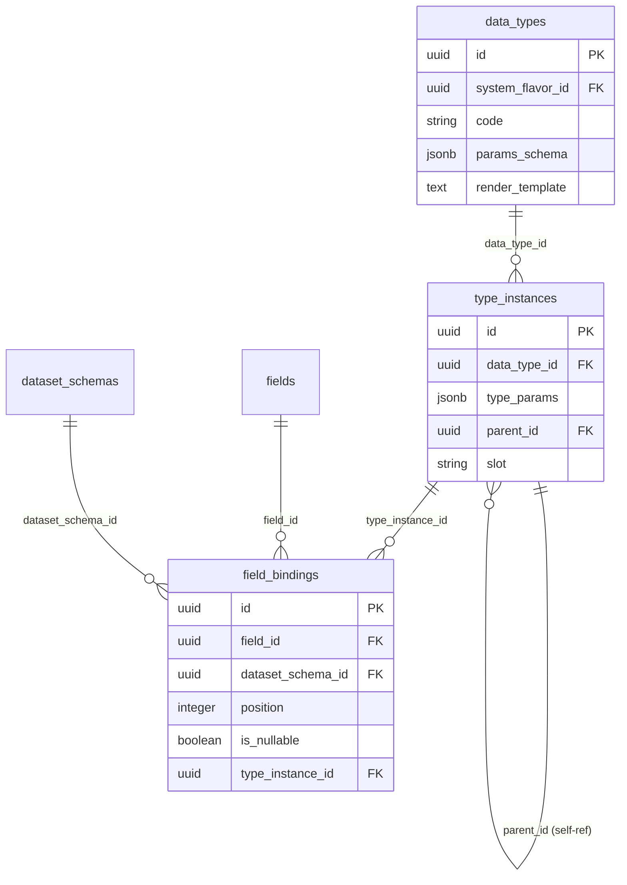

# Design Plan: TypeInstance — Composite Type Support

**Status:** Proposed
**Date:** 2026-04-07

---

## 1. Context and Problem

The current type system is **flat**: `FieldBinding.data_type_id` references a single `DataType`, and `type_params` stores scalar parameters (`{"length": 255}`).

**Composite types cannot be represented:**

| System | Example | Problem |
|--------|---------|---------|
| Hive / Spark | `ARRAY<STRING>` | Type contains a reference to another type |
| Hive / Spark | `MAP<STRING, INT>` | Two type arguments |
| Hive / Spark | `STRUCT<name: STRING, age: INT>` | Nested structure with named fields |
| BigQuery | `ARRAY<STRUCT<x INT64, y FLOAT64>>` | Recursive nesting |
| PostgreSQL | `INTEGER[]`, `TEXT[][]` | Arrays |
| Kafka (Avro) | Union types, nested records | Schema within schema |

---

## 2. Solution

A new `TypeInstance` model — a tree of type instances with a self-referencing FK. `FieldBinding` references the tree root instead of a direct `DataType`.

**Principle:**
- `DataType` — **catalog** ("Hive has a type called ARRAY")
- `TypeInstance` — **usage** ("this column is ARRAY<VARCHAR(255)>")

---

## 3. Data Model

### New table `type_instances`

| Column | Type | Description |
|--------|------|-------------|
| `id` | UUID PK | MetaDataMixin |
| `data_type_id` | FK → data_types | Which catalog type (ARRAY, VARCHAR, MAP, STRUCT, ...) |
| `type_params` | JSONB nullable | Scalar parameters (`{"length": 255}`, `{"precision": 10}`) |
| `parent_id` | FK → type_instances | Nested inside which instance (NULL = root) |
| `slot` | String(255) nullable | Argument role: `"element"`, `"key"`, `"value"`, `"field:<name>"` |
| + | MetaDataMixin | `created_at`, `updated_at`, `created_by`, `updated_by`, `note` |

**Unique constraint:** `(parent_id, slot)` — a parent cannot have two children with the same slot.

### Changes to `field_bindings`

**Before:**
```
data_type_id: FK → data_types
type_params:  JSONB
```

**After:**
```
type_instance_id: FK → type_instances  (reference to tree root)
```

Columns `data_type_id` and `type_params` are removed from `field_bindings`.

### CastRule — no changes

CastRule stays at the `DataType` (catalog) level. Casting `ARRAY<X>` → `ARRAY<Y>` is determined recursively via `X → Y` cast in the service layer.

---

## 4. Examples

### VARCHAR(255) — flat type (single node)

```
TypeInstance(id=1, data_type=VARCHAR, type_params={"length": 255}, parent=NULL, slot=NULL)

FieldBinding.type_instance_id → 1
```

### ARRAY\<VARCHAR(255)\> — two nodes

```
TypeInstance(id=1, data_type=ARRAY,   type_params=NULL,            parent=NULL, slot=NULL)
TypeInstance(id=2, data_type=VARCHAR, type_params={"length": 255}, parent=1,    slot="element")

FieldBinding.type_instance_id → 1
```

### MAP\<STRING, DECIMAL(10,2)\> — three nodes

```
TypeInstance(id=1, data_type=MAP,     type_params=NULL,                parent=NULL, slot=NULL)
TypeInstance(id=2, data_type=STRING,  type_params=NULL,                parent=1,    slot="key")
TypeInstance(id=3, data_type=DECIMAL, type_params={"p": 10, "s": 2},  parent=1,    slot="value")
```

### ARRAY\<STRUCT\<name STRING, age INT\>\> — five nodes

```
TypeInstance(id=1, data_type=ARRAY,  type_params=NULL, parent=NULL, slot=NULL)
TypeInstance(id=2, data_type=STRUCT, type_params=NULL, parent=1,    slot="element")
TypeInstance(id=3, data_type=STRING, type_params=NULL, parent=2,    slot="field:name")
TypeInstance(id=4, data_type=INT,    type_params=NULL, parent=2,    slot="field:age")
```

---

## 5. ER Diagram (changes)



---

## 6. Files to Create / Modify

### New files

| File | Description |
|------|-------------|
| `backend/models/type_instance.py` | SQLAlchemy model with self-ref FK |
| `backend/schemas/type_instance.py` | Pydantic Create/Read/Update + recursive `TypeInstanceTree` |
| `backend/repositories/type_instance.py` | Repository with recursive queries |
| `backend/services/type_instance.py` | Service with tree validation |
| `backend/api/v1/type_instances.py` | REST API endpoints |
| `backend/alembic/versions/XXX_add_type_instance.py` | Migration |

### Modified files

| File | What changes |
|------|-------------|
| `backend/models/field_binding.py` | `data_type_id` + `type_params` → `type_instance_id` |
| `backend/schemas/field_binding.py` | Update Create/Read/Update schemas |
| `backend/services/field_binding.py` | Validate `type_instance_id` instead of `data_type_id` |
| `backend/repositories/field_binding.py` | Remove data_type query |
| `backend/db/uow.py` | Add `self.type_instances = TypeInstanceRepository(...)` |
| `backend/core/errors.py` | Add `TYPE_INSTANCE_NOT_FOUND`, `TYPE_INSTANCE_SLOT_ALREADY_EXISTS` |
| `backend/main.py` | Register `type_instances` router |

---

## 7. Validation (service layer)

### TypeInstanceService._pre_create

- `data_type_id` exists in `data_types` catalog
- If `parent_id` is not NULL → parent exists in `type_instances`
- If `parent_id` is not NULL → `slot` is **required**
- If `parent_id` is NULL → `slot` **must be NULL** (root node)
- Uniqueness of `(parent_id, slot)`

### Additional methods

- `get_tree(root_id)` — recursively load the full type tree
- `delete_tree(root_id)` — delete root and all child instances

---

## 8. Pydantic Schemas

```python
# Flat — for CRUD API
class TypeInstanceCreate:
    data_type_id: UUID
    type_params: dict[str, Any] | None = None
    parent_id: UUID | None = None
    slot: str | None = None

class TypeInstanceRead(MetaDataMixin):
    data_type_id: UUID
    type_params: dict[str, Any] | None
    parent_id: UUID | None
    slot: str | None

# Recursive — for tree reading
class TypeInstanceTree(MetaDataMixin):
    data_type_id: UUID
    type_params: dict[str, Any] | None
    slot: str | None
    children: list["TypeInstanceTree"]
```

---

## 9. Data Migration Strategy

Single Alembic migration, three steps:

1. **Create table** `type_instances`
2. **Migrate data**: for each existing `FieldBinding`, create `TypeInstance(data_type_id=fb.data_type_id, type_params=fb.type_params, parent=NULL, slot=NULL)` and write `type_instance_id` into `field_binding`
3. **Drop columns** `data_type_id` and `type_params` from `field_bindings`

---

## 10. Implementation Order

1. `TypeInstance` model + migration (table only, no field_bindings changes)
2. Repository + Service + Schemas + API for TypeInstance
3. Tests for TypeInstance CRUD and tree operations
4. field_bindings migration (`data_type_id` → `type_instance_id`)
5. Update FieldBinding model / schema / service / repo / api
6. Update FieldBinding tests
7. Update UoW, main.py, errors.py

---

## 11. Test Plan

- Create flat TypeInstance (`VARCHAR(255)`)
- Create tree (`ARRAY<VARCHAR(255)>`)
- Create deep tree (`ARRAY<STRUCT<name STRING, age INT>>`)
- Validation: slot is required when parent_id is not NULL
- Validation: slot is forbidden when parent_id is NULL
- Validation: uniqueness of (parent_id, slot)
- Validation: data_type_id exists
- Validation: parent_id exists
- `get_tree()` returns full tree
- FieldBinding with type_instance_id
- Migration: existing data correctly migrated
