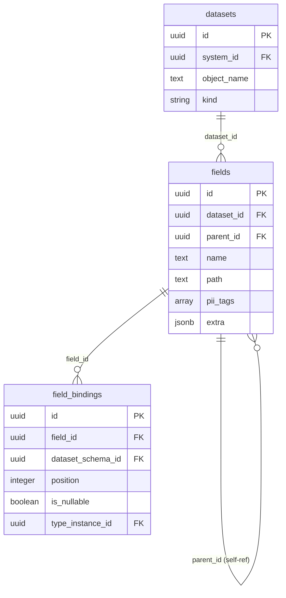

# Design Plan: Nested Fields — Hierarchical Field Structure

**Status:** Proposed
**Date:** 2026-04-08

---

## 1. Context and Problem

Currently `Field` is a **flat list** of fields per dataset. The `path` column is a plain string (`"customer.email"`) with no structural integrity.

```
Field(name="order_id",           path=NULL)
Field(name="customer_name",      path="customer.name")
Field(name="customer_email",     path="customer.email")
```

**What doesn't work:**

| Problem | Description |
|---------|-------------|
| No tree structure | Cannot query "all fields nested inside `customer`" |
| No intermediate nodes | `customer` itself is not a Field — cannot attach type (STRUCT), pii_tags, or metadata to it |
| Rename cascading | Renaming `customer` → `client` requires manually updating all `path` strings |
| No FK integrity | `path` is a plain string, no validation that the parent level exists |
| No type binding | Cannot describe that `customer` is a STRUCT via TypeInstance (see `04_type_instance_design.md`) |

**Real-world nested structures (Kafka, Hive, Avro, BigQuery):**

```
order                        (root)
├── order_id                 (INT)
├── customer                 (STRUCT)
│   ├── name                 (STRING)
│   └── email                (STRING, pii_tags=["email"])
└── items                    (ARRAY<STRUCT>)
    ├── product_name         (STRING)
    └── quantity             (INT)
```

Each node in this tree should be a first-class `Field` with its own FieldBinding, pii_tags, extra, and TypeInstance.

---

## 2. Solution

Add `parent_id` (self-referencing FK) to the `fields` table.

**Approach:** Variant A — consistent with TypeInstance (same self-ref FK pattern used in `04_type_instance_design.md`).

---

## 3. Data Model

### Changes to `fields` table

| Change | Details |
|--------|---------|
| **Add column** | `parent_id: FK → fields.id (nullable)` — NULL means root-level field |
| **Change constraint** | `(dataset_id, name)` → `(dataset_id, parent_id, name)` — name is unique among siblings, not globally |
| **Keep column** | `path` stays as a **denormalized cache** (computed from tree), nullable |

### Updated `fields` schema

| Column | Type | Description |
|--------|------|-------------|
| `id` | UUID PK | MetaDataMixin |
| `dataset_id` | FK → datasets | Which dataset this field belongs to |
| `parent_id` | FK → fields.id | **NEW** — parent field (NULL = root level) |
| `name` | Text | Field name (unique among siblings) |
| `path` | Text nullable | Denormalized dot-path cache (`"customer.email"`) |
| `pii_tags` | ARRAY(Text) nullable | PII markers |
| `extra` | JSONB nullable | Additional metadata |
| + | MetaDataMixin | `created_at`, `updated_at`, `created_by`, `updated_by`, `note` |

---

## 4. Examples

### Flat table (no nesting) — backward compatible

```
Field(id=1, name="user_id",   parent=NULL, dataset_id=X, path=NULL)
Field(id=2, name="email",     parent=NULL, dataset_id=X, path=NULL)
Field(id=3, name="full_name", parent=NULL, dataset_id=X, path=NULL)
```

Exactly the same as today. `parent_id = NULL` for all root fields.

### Kafka message with nested STRUCT

```
Field(id=1, name="order_id",     parent=NULL, dataset_id=X, path="order_id")
Field(id=2, name="customer",     parent=NULL, dataset_id=X, path="customer")
Field(id=3, name="name",         parent=2,    dataset_id=X, path="customer.name")
Field(id=4, name="email",        parent=2,    dataset_id=X, path="customer.email",
      pii_tags=["email"])
Field(id=5, name="items",        parent=NULL, dataset_id=X, path="items")
Field(id=6, name="product_name", parent=5,    dataset_id=X, path="items.product_name")
Field(id=7, name="quantity",     parent=5,    dataset_id=X, path="items.quantity")
```

**Key points:**
- `customer` (id=2) is a real Field — can have FieldBinding with TypeInstance(STRUCT) and its own metadata
- `items` (id=5) is a real Field — can have FieldBinding with TypeInstance(ARRAY<STRUCT>)
- `name` (id=3) has `parent_id=2` — structurally nested inside `customer`
- `path` is a computed cache: `parent.path + "." + name`

### Integration with TypeInstance (from `04_type_instance_design.md`)

```
Field(id=2, name="customer")
  → FieldBinding(type_instance_id → TypeInstance(STRUCT))

Field(id=3, name="name", parent_id=2)
  → FieldBinding(type_instance_id → TypeInstance(STRING))

Field(id=5, name="items")
  → FieldBinding(type_instance_id → TypeInstance(ARRAY, children=[TypeInstance(STRUCT)]))
```

The **field tree** describes data structure. The **type instance tree** describes type composition. They work together but are independent.

---

## 5. ER Diagram (changes)



---

## 6. Files to Create / Modify

### No new files — only modifications

| File | What changes |
|------|-------------|
| `backend/models/field.py` | Add `parent_id` FK, `parent`/`children` relationships, update unique constraint |
| `backend/schemas/field.py` | Add `parent_id` to Create/Read/Update + new `FieldTree` recursive schema |
| `backend/services/field.py` | Validate parent_id in `_pre_create`/`_pre_update`, add `get_tree()` method |
| `backend/repositories/field.py` | Add `get_children()`, `get_by_parent_and_name()` methods |
| `backend/core/errors.py` | Add `FIELD_PARENT_NOT_FOUND`, `FIELD_PARENT_DATASET_MISMATCH` |
| `backend/alembic/versions/XXX_add_field_parent.py` | Migration: add column, update constraint |

---

## 7. Validation (service layer)

### FieldService._pre_create — updated rules

Existing:
- `dataset_id` exists
- `(dataset_id, name)` is unique

New:
- If `parent_id` is not NULL → parent Field exists
- If `parent_id` is not NULL → parent's `dataset_id` matches this field's `dataset_id` (no cross-dataset nesting)
- Uniqueness changes: `(dataset_id, parent_id, name)` — name unique among siblings

### FieldService._pre_update — updated rules

- If `parent_id` changes → validate new parent exists and belongs to same dataset
- If `parent_id` changes → prevent circular references (field cannot be its own ancestor)
- If `name` changes → re-validate uniqueness among new siblings

### Additional methods

- `get_tree(dataset_id)` — return full field tree for a dataset
- `get_children(field_id)` — return direct children of a field

---

## 8. Pydantic Schemas

```python
# Updated flat schemas
class FieldCreate(FieldBase, NoteMixin):
    parent_id: UUID | None = None      # NEW

class FieldRead(FieldBase, MetaDataMixin):
    parent_id: UUID | None             # NEW

class FieldUpdate(NoteMixin):
    parent_id: UUID | None = None      # NEW
    ...existing optional fields...

# Recursive — for tree reading
class FieldTree(MetaDataMixin):
    dataset_id: UUID
    name: str
    path: str | None
    pii_tags: list[str] | None
    extra: dict[str, Any] | None
    children: list["FieldTree"]
```

---

## 9. Data Migration Strategy

Single Alembic migration, two steps:

1. **Add column** `parent_id` (FK → fields.id, nullable) to `fields` table
2. **Replace unique constraint**: drop `idx_field_dataset_id_name`, create `idx_field_dataset_id_parent_id_name` on `(dataset_id, parent_id, name)`

All existing fields get `parent_id = NULL` — they remain root-level. **Fully backward compatible**, no data transformation needed.

---

## 10. Unique Constraint Detail

The constraint `(dataset_id, parent_id, name)` needs special handling for NULL parent_id in PostgreSQL.

PostgreSQL treats NULLs as distinct in unique constraints, so `(dataset_id=X, parent_id=NULL, name="email")` can exist multiple times. Two options:

**Option A:** Partial unique index
```sql
CREATE UNIQUE INDEX idx_field_root_name ON fields (dataset_id, name) WHERE parent_id IS NULL;
CREATE UNIQUE INDEX idx_field_nested_name ON fields (dataset_id, parent_id, name) WHERE parent_id IS NOT NULL;
```

**Option B:** Use COALESCE with a sentinel
```sql
CREATE UNIQUE INDEX idx_field_parent_name ON fields (dataset_id, COALESCE(parent_id, '00000000-0000-0000-0000-000000000000'), name);
```

**Recommended:** Option A (two partial indexes) — cleaner, standard PostgreSQL approach.

---

## 11. Implementation Order

1. Migration: add `parent_id` column + update unique constraints
2. Update Field model (add column, relationships, constraints)
3. Update Field schemas (add `parent_id`, add `FieldTree`)
4. Update Field repository (add `get_children`, `get_by_parent_and_name`)
5. Update Field service (validate `parent_id`, circular ref check, `get_tree`)
6. Add error codes (`FIELD_PARENT_NOT_FOUND`, `FIELD_PARENT_DATASET_MISMATCH`)
7. Update existing Field tests
8. Add new tests for nested fields

---

## 12. Test Plan

**Backward compatibility:**
- Create root field (parent_id=NULL) — works as before
- Unique constraint (dataset_id, name) still enforced for root fields
- Existing API calls without parent_id continue to work

**Nested fields:**
- Create child field with valid parent_id
- Create grandchild (two levels of nesting)
- Validate: parent must exist
- Validate: parent must belong to same dataset
- Validate: name unique among siblings (same parent)
- Validate: same name allowed at different levels
- Validate: circular reference prevention (update parent_id to own child)

**Tree operations:**
- `get_tree(dataset_id)` returns correct hierarchy
- `get_children(field_id)` returns direct children only
- Delete parent field — behavior with children (error or cascade, TBD)

**Integration with TypeInstance:**
- Nested field with TypeInstance(STRUCT) on parent, TypeInstance(STRING) on child
- Full tree: Field tree + TypeInstance tree on each FieldBinding
